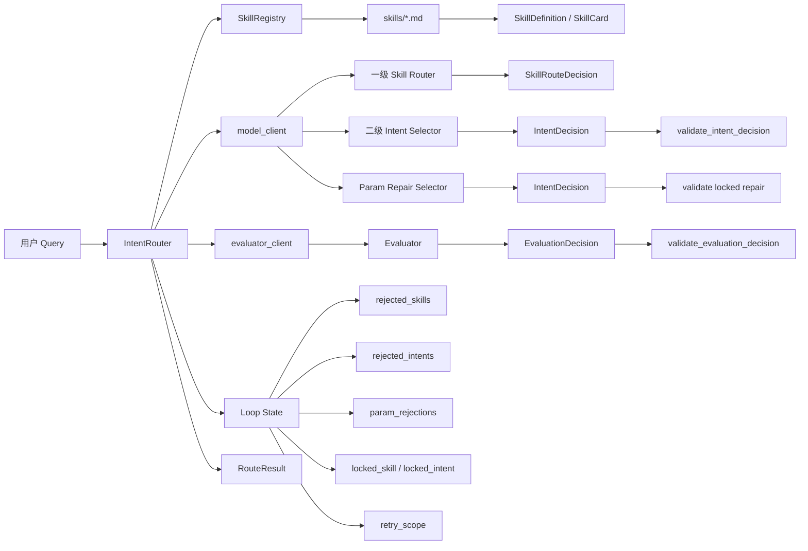
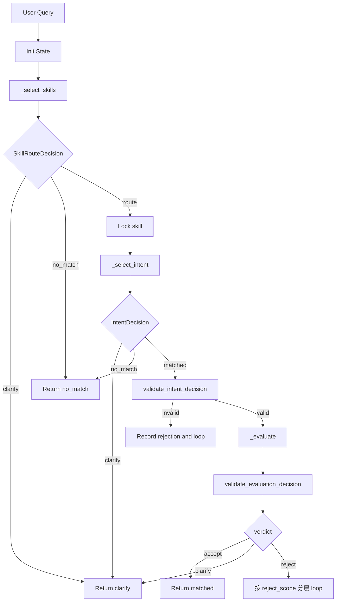

# 移动云盘意图路由分层 Loop 纠错方案设计文档

## 1. 方案目标

当前系统目标是将用户自然语言请求识别为结构化路由结果：

```json
{
  "status": "matched",
  "skill": {
    "id": "...",
    "name": "..."
  },
  "intent": "...",
  "code": "...",
  "params": {}
}
```

本方案在现有架构基础上增强意图识别准确率，重点解决：

- 一级 skill 选错后的纠错。
- 二级 intent 选错后的纠错。
- intent 正确但参数抽取错误时的修正。
- 避免 evaluator 直接推荐标签导致错误叠加。
- 避免所有错误都重新跑一级路由造成不稳定。

核心设计原则：

```text
selector 负责“选什么”
evaluator 负责“判断错在哪一层”
router controller 负责“决定下一轮跑哪一层”
```

## 2. 总体架构

系统采用三阶段识别 + 分层 evaluator + loop controller 的架构。

```text
User Query
  -> 一级 Skill 路由
  -> 二级 Intent 选择
  -> 本地结构校验
  -> Evaluator 分层评估
  -> accept / clarify / 分层 retry / no_match
```

整体模块关系：



## 3. 核心模块设计

### 3.1 IntentRouter

`IntentRouter` 是系统主编排器，负责：

- 初始化路由状态。
- 调用一级 skill 路由。
- 调用二级 intent 选择。
- 调用参数修正节点。
- 调用 evaluator。
- 根据 evaluator 输出决定 loop 方向。
- 返回最终 `RouteResult`。

核心入口：

```python
await router.route(query, resume_token=None, context=None)
```

返回状态包括：

```text
matched   成功识别到 skill + intent + code + params
clarify   需要用户补充信息
no_match  无可用能力或重试失败
```

### 3.2 SkillRegistry

`SkillRegistry` 负责加载本地 `skills/*.md`。

每个 skill 文件包含：

- frontmatter：`name`、`description`
- `Special Rules`
- `Tools Schema`

加载后形成：

```python
SkillDefinition(
    id,
    name,
    description,
    special_rules,
    tools_schema_text,
    raw_markdown,
    intents
)
```

一级路由阶段使用轻量摘要：

```python
SkillCard(
    id,
    name,
    description,
    intents
)
```

二级 intent 和 evaluator 阶段使用完整 skill 信息。

### 3.3 model_client

`model_client` 负责调用主模型。

当前主模型用于：

- 一级 skill 选择。
- 二级 intent 选择。
- 参数修正。

统一接口：

```python
await model_client.structured(
    system_prompt=...,
    user_prompt=...,
    response_model=...
)
```

### 3.4 evaluator_client

`evaluator_client` 负责对候选结果做语义复核。

默认情况下：

- 如果显式传入 `evaluator_client`，使用独立 evaluator。
- 如果未传入，但配置了 evaluator 环境变量，使用独立 evaluator 模型。
- 否则复用 `model_client`。

evaluator 不负责生成最终标签，只负责判断当前候选是否正确，以及错在哪一层。

## 4. 数据模型设计

### 4.1 SkillRouteDecision

一级路由输出：

```python
class SkillRouteDecision(BaseModel):
    status: Literal["route", "clarify", "no_match"]
    skill_id: str | None
    confidence: float
    reason: str
    question: str | None
    options: list[dict[str, str]]
```

含义：

- `route`：选择一个 skill。
- `clarify`：一级能力边界不清，需要用户澄清。
- `no_match`：没有 skill 支持该需求。

### 4.2 IntentDecision

二级 intent 输出与参数修正输出共用该模型：

```python
class IntentDecision(BaseModel):
    status: Literal["matched", "clarify", "no_match"]
    intent: str | None
    code: str | None
    params: dict[str, Any]
    confidence: float
    reason: str
    question: str | None
    options: list[dict[str, str]]
```

含义：

- `matched`：识别到具体 intent/code/params。
- `clarify`：同 skill 内多个 intent 难以区分。
- `no_match`：当前 skill 无法承接用户请求。

### 4.3 EvaluationDecision

evaluator 输出：

```python
class EvaluationDecision(BaseModel):
    verdict: Literal["accept", "reject", "clarify"]
    reject_scope: Literal[
        "skill_mismatch",
        "intent_mismatch",
        "param_mismatch"
    ] | None

    skill_check: Literal["pass", "fail", "unclear"] | None
    intent_check: Literal["pass", "fail", "unclear"] | None
    params_check: Literal["pass", "fail", "unclear"] | None

    confidence: float
    reason: str
    question: str | None
    options: list[dict[str, str]]
```

设计要点：

- evaluator 不输出 `suggested_skill_id`。
- evaluator 不输出 `suggested_intent`。
- evaluator 不输出 `suggested_params`。
- evaluator 只说明当前候选是否通过，以及失败层级。

## 5. Loop State 设计

路由过程中维护内部 state。

```python
{
    "original_query": "...",
    "clarifications": [],

    "visited_skills": [],
    "rejected_skills": [],
    "rejected_intents": {},

    "param_rejections": {},

    "locked_skill_id": None,
    "locked_skill_confidence": None,
    "locked_intent": None,
    "locked_code": None,

    "retry_scope": "reroute_skill",

    "rejections": []
}
```

### 5.1 rejected_skills

仅当 evaluator 明确判断：

```text
skill_check=fail
reject_scope=skill_mismatch
```

才写入。

作用：

- 下一轮一级路由不得再选择这些 skill。

### 5.2 rejected_intents

仅当 evaluator 明确判断：

```text
skill_check=pass
intent_check=fail
reject_scope=intent_mismatch
```

才写入。

作用：

- 当前 skill 正确，但该 intent 不合适。
- 下一轮二级 intent 选择时避免重复选择该 intent。

### 5.3 param_rejections

仅当 evaluator 明确判断：

```text
skill_check=pass
intent_check=pass
params_check=fail
reject_scope=param_mismatch
```

才写入。

作用：

- 记录参数错误原因。
- 不影响 intent 选择。
- 不把当前 intent 写入 `rejected_intents`，避免误伤正确 intent。

### 5.4 locked_skill_id

当 evaluator 判断 skill 通过时，锁定当前 skill。

适用场景：

- intent 错误后，只重跑二级 intent。
- 参数错误后，只重修 params。

### 5.5 locked_intent / locked_code

当 evaluator 判断 skill 和 intent 都通过，只是参数错误时，锁定 intent/code。

作用：

- 参数修正阶段禁止改 intent/code。
- 只允许修正 params。

### 5.6 retry_scope

控制下一轮执行范围。

取值：

```text
reroute_skill  重新跑一级 skill 路由
retry_intent   锁定 skill，只重跑二级 intent
retry_params   锁定 skill + intent + code，只修正 params
```

## 6. 完整流程设计

### 6.1 初始请求流程



### 6.2 skill_mismatch 流程

当 evaluator 输出：

```json
{
  "verdict": "reject",
  "reject_scope": "skill_mismatch",
  "skill_check": "fail"
}
```

执行：

```text
1. rejected_skills += current skill
2. 清空 locked_skill_id / locked_intent / locked_code
3. retry_scope = reroute_skill
4. 下一轮重新调用 _select_skills
```

目的：

- 兼容一级 skill 初始选择错误。
- 保留原始 loop 纠错能力。

### 6.3 intent_mismatch 流程

当 evaluator 输出：

```json
{
  "verdict": "reject",
  "reject_scope": "intent_mismatch",
  "skill_check": "pass",
  "intent_check": "fail"
}
```

执行：

```text
1. locked_skill_id = current skill
2. rejected_intents[current skill] += current intent
3. 清空 locked_intent / locked_code
4. retry_scope = retry_intent
5. 下一轮跳过 _select_skills
6. 直接调用 _select_intent
```

目的：

- 保留当前正确 skill。
- 避免二级错误导致一级重新波动。
- 只在当前 skill 内重新选择 intent。

### 6.4 param_mismatch 流程

当 evaluator 输出：

```json
{
  "verdict": "reject",
  "reject_scope": "param_mismatch",
  "skill_check": "pass",
  "intent_check": "pass",
  "params_check": "fail"
}
```

执行：

```text
1. locked_skill_id = current skill
2. locked_intent = current intent
3. locked_code = current code
4. param_rejections[current skill/current intent] += reason
5. retry_scope = retry_params
6. 下一轮跳过 _select_skills
7. 跳过普通 _select_intent
8. 调用 _repair_params
```

目的：

- 参数错误不影响 skill。
- 参数错误不影响 intent。
- 避免将正确 intent 加入 `rejected_intents`。

### 6.5 参数修正流程

参数修正节点输入：

```json
{
  "query": "...",
  "skill_id": "...",
  "skill_markdown": "...",
  "locked_intent": "...",
  "locked_code": "...",
  "intent_schema": {},
  "param_rejections": []
}
```

模型必须输出：

```python
IntentDecision(
    status="matched",
    intent=locked_intent,
    code=locked_code,
    params={...}
)
```

本地强校验：

```text
intent 必须等于 locked_intent
code 必须等于 locked_code
params 必须符合该 intent schema
```

如果修正阶段改了 intent/code：

```text
1. 记录 invalid_param_repair
2. 继续 retry_params
3. 超过 max_attempts 后 no_match
```

## 7. Evaluator 一致性校验

新增 `validate_evaluation_decision()`。

### 7.1 accept 校验

当：

```python
verdict == "accept"
```

要求：

```text
不能有 reject_scope
不能存在 fail check
```

### 7.2 skill_mismatch 校验

当：

```python
reject_scope == "skill_mismatch"
```

要求：

```text
skill_check == "fail"
```

### 7.3 intent_mismatch 校验

当：

```python
reject_scope == "intent_mismatch"
```

要求：

```text
skill_check == "pass"
intent_check == "fail"
```

### 7.4 param_mismatch 校验

当：

```python
reject_scope == "param_mismatch"
```

要求：

```text
skill_check == "pass"
intent_check == "pass"
params_check == "fail"
```

### 7.5 不一致输出处理

如果 evaluator 输出不一致，例如：

```json
{
  "verdict": "reject",
  "reject_scope": "param_mismatch",
  "skill_check": "pass",
  "intent_check": "fail",
  "params_check": "fail"
}
```

系统不采纳该评估结果。

处理策略：

```text
第一次 invalid_evaluation:
  full reroute 一次

再次 invalid_evaluation:
  no_match
```

原因：

- 避免 evaluator 错误信号污染 loop。
- 保留一次恢复机会。

## 8. Prompt 设计

### 8.1 一级路由 Prompt

职责：

- 从 `SkillCard` 中选择一个最可能 skill。
- 只能返回一个 skill。
- 不得选择 `rejected_skill_ids`。
- 无能力支持时返回 `no_match`。
- 多个 skill 都可满足且用户补充会改变选择时返回 `clarify`。

输入：

```json
{
  "query": "...",
  "available_skills": [],
  "rejected_skill_ids": []
}
```

### 8.2 二级 Intent Prompt

职责：

- 在当前 skill 内选择最佳 intent。
- 严格遵守完整 `Skill.md`。
- 避免选择 `rejected_intents`。
- 注意 `param_rejections` 只表示参数错误，不代表 intent 错误。

输入：

```json
{
  "query": "...",
  "skill_id": "...",
  "skill_markdown": "...",
  "rejected_intents": [],
  "param_rejections": []
}
```

### 8.3 参数修正 Prompt

职责：

- 固定 skill/intent/code。
- 只修正 params。
- 避免重复此前参数错误。
- 不做 intent 重选。

输入：

```json
{
  "query": "...",
  "skill_id": "...",
  "skill_markdown": "...",
  "locked_intent": "...",
  "locked_code": "...",
  "intent_schema": {},
  "param_rejections": []
}
```

输出：

```json
{
  "status": "matched",
  "intent": "locked_intent",
  "code": "locked_code",
  "params": {}
}
```

### 8.4 Evaluator Prompt

职责：

- 判断当前候选是否真正满足用户请求。
- 按 skill -> intent -> params 顺序检查。
- 输出分层检查结果。
- 不输出推荐标签。

关键约束：

```text
不要输出或暗示推荐 skill_id / intent / code。
只负责判断当前候选是否正确以及错在哪一层。
```

## 9. 错误处理策略

### 9.1 一级路由无结果

```text
SkillRouteDecision.status = no_match
=> Return no_match
```

### 9.2 一级路由需要澄清

```text
SkillRouteDecision.status = clarify
=> Return clarify + resume_token
```

### 9.3 二级 intent 无结果

如果当前是初始一级路由路径：

```text
当前 skill 加入 rejected_skills
重新一级路由
```

如果当前是 locked retry 路径：

```text
Return no_match
```

### 9.4 本地 intent 校验失败

分两类：

```text
intent/code 本身非法
=> rejected_intents，retry_intent

intent/code 正确但 params 非法
=> param_rejections，retry_params
```

### 9.5 evaluator 输出不一致

```text
第一次：full reroute 一次
第二次：no_match
```

### 9.6 超过最大尝试次数

```text
Return no_match
reason = "Exceeded maximum routing attempts"
```

## 10. 当前方案优势

### 10.1 保留一级纠错能力

当 skill 真错时，系统仍会重新跑一级路由。

这解决了最初担心的问题：

```text
如果一级已经错了，只重跑二级 intent 无法修复。
```

### 10.2 降低不必要波动

当 skill 已经正确，只是 intent 错时，不再重新一级路由。

这降低了：

- skill 来回跳。
- 同一 query 多轮选择不稳定。
- 已正确 skill 被误排除。

### 10.3 参数错误不误伤 intent

过去参数错误会被记录到 `rejected_intents`。

现在参数错误进入独立 `param_rejections`。

这避免了：

```text
搜音频 intent 正确
但 suffixList 过度补全
=> 错误地避开 搜音频
```

### 10.4 evaluator 不直接污染标签

evaluator 仍然不输出建议标签。

它只输出：

```text
skill_check
intent_check
params_check
reject_scope
reason
```

最终选择仍由 selector 完成。

### 10.5 可观测性更强

state 中保留：

```text
visited_skills
rejected_skills
rejected_intents
param_rejections
rejections
retry_scope
```

后续可以统计：

- 哪些 skill 经常被拒。
- 哪些 intent 经常混淆。
- 哪些 params 经常幻觉。
- loop 是否真正提升准确率。

## 11. 测试覆盖

当前测试已覆盖：

```text
26 passed
```

主要测试场景：

- 正常 matched。
- skill no_match 后重新一级路由。
- skill_mismatch 后重新一级路由。
- intent_mismatch 后锁定 skill，只重跑二级。
- param_mismatch 后锁定 skill + intent + code，只修参数。
- 参数修正不能改 intent/code。
- evaluator 输出不一致时不会直接采纳。
- 支持独立 evaluator_client。
- clarify + resume_token。
- invalid resume_token。
- skill 加载和 allowed values 校验。
- evaluator 分层校验。

## 12. 后续建议

### 12.1 建立真实评测集

建议新增 JSONL：

```json
{"query": "帮我找周杰伦的歌", "expected": {"skill": "mcloud_search_skill", "intent": "搜音频"}}
{"query": "打开AI修图", "expected": {"skill": "image_skill", "intent": "AI 修图"}}
{"query": "把这张图背景换成海边", "expected": {"skill": "image_skill", "intent": "AI改图"}}
```

### 12.2 增加准确率指标

建议统计：

```text
first_pass_accuracy
after_loop_accuracy
clarify_rate
no_match_rate
average_attempts
skill_mismatch_count
intent_mismatch_count
param_mismatch_count
invalid_evaluation_count
```

### 12.3 后续再考虑 top-k

当前阶段先验证分层 loop 是否提升。

如果发现一级召回仍然不足，再考虑：

```text
一级 top-k skill candidates
二级多候选 intent
evaluator rerank
```

但这会增加复杂度和成本，不建议作为当前第一步。

## 13. 总结

本方案不是推翻原有 loop，而是将原来的：

```text
reject 后重新猜
```

升级为：

```text
判断错在哪一层，再只重跑必要层
```

最终系统行为变为：

```text
skill 错 -> 重跑一级
intent 错 -> 锁定 skill，重跑二级
params 错 -> 锁定 skill + intent，只修参数
```

这既保留了 loop 纠一级错误的能力，又减少了 intent/params 错误时的无效波动，是当前架构下更稳妥的准确率优化方向。
