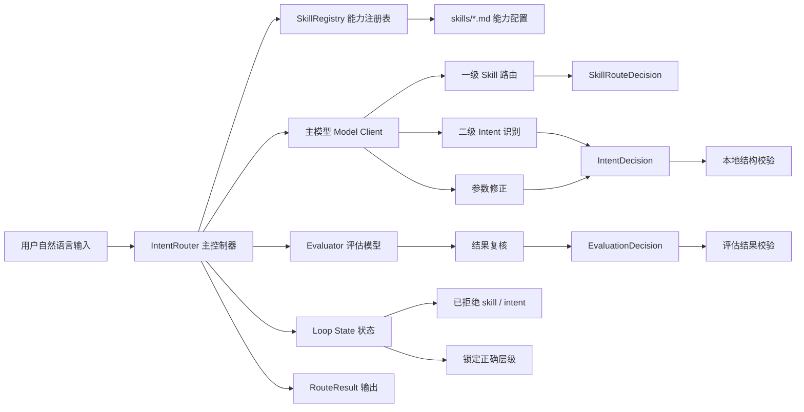
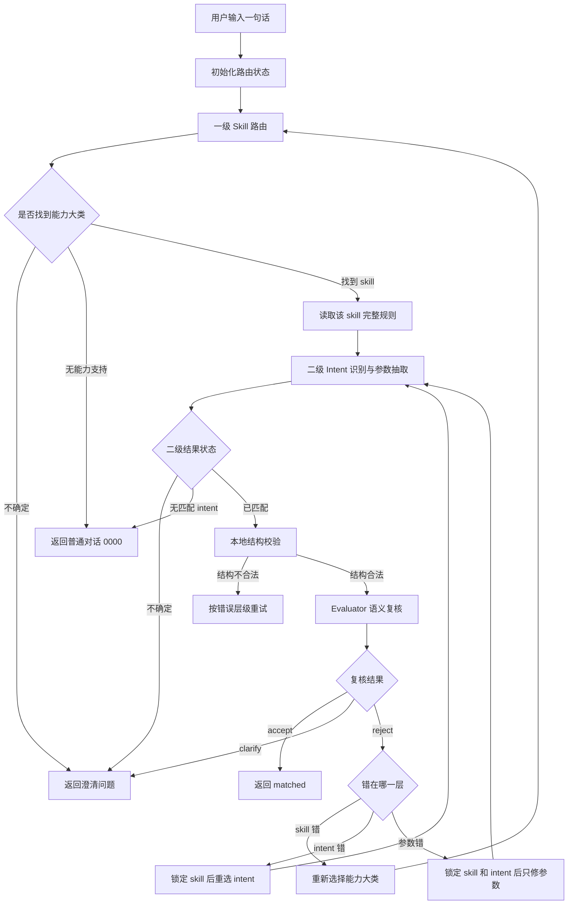
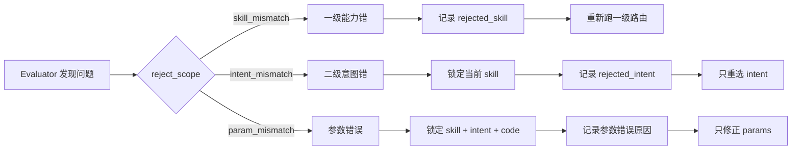
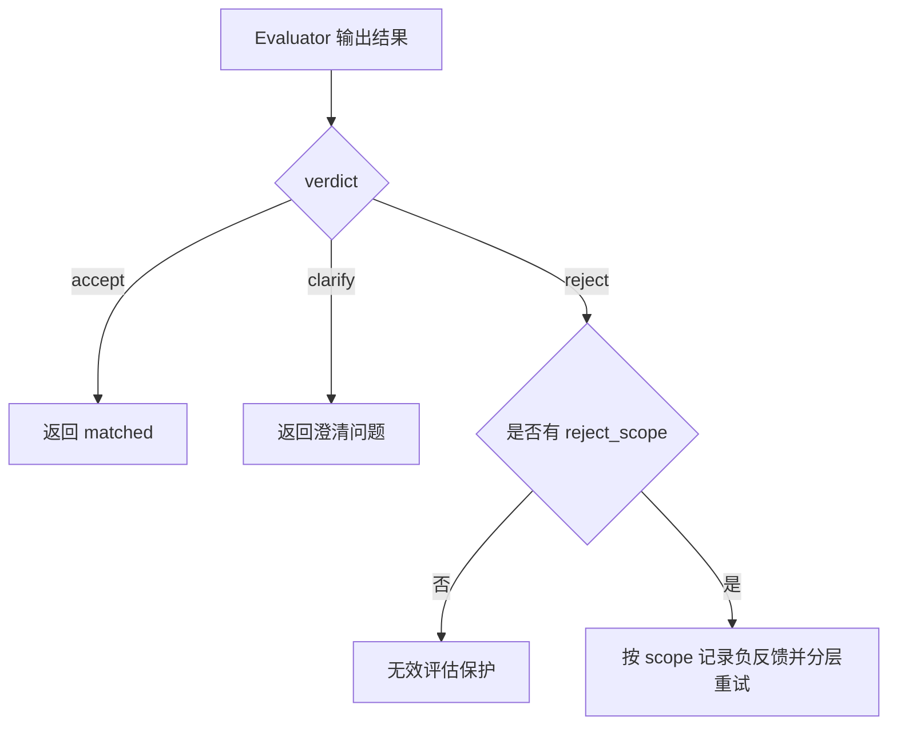
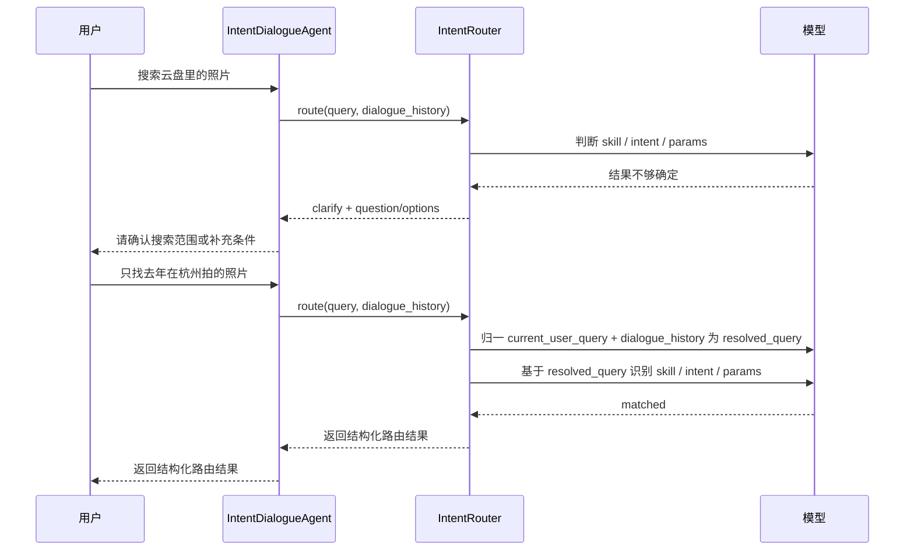

# 移动云盘意图识别项目进展汇报

汇报日期：2026-06-24

## 一、项目目标

本项目建设的是移动云盘自然语言意图识别路由能力。用户用一句自然语言表达需求后，系统需要自动判断：

- 用户要使用哪一类云盘能力，例如搜索、文件管理、图像 AI、笔记、待办、办公创作等。
- 该能力下具体要调用哪个二级功能，例如“搜图片”“AI 生成 PPT”“AI 待办添加”等。
- 需要给业务工具传递哪些结构化参数，例如时间、地点、关键词、文件类型、待办事项等。
- 当系统不确定时，不盲目调用工具，而是向用户发起澄清或确认。

最终输出示例：

```json
{
  "status": "matched",
  "skill": {
    "id": "mcloud_search_skill",
    "name": "云盘搜索"
  },
  "intent": "搜图片",
  "code": "012",
  "params": {
    "timeList": ["上个月"],
    "metadataList": ["猫"],
    "placeList": ["北京"]
  },
  "confidence": 0.7
}
```

## 二、当前进展概览

目前项目已经完成一套可运行、可测试、可扩展的意图识别主链路。

| 模块 | 当前状态 | 说明 |
| --- | --- | --- |
| Skill 能力配置 | 已完成基础框架 | 通过 `skills/*.md` 管理业务能力、规则和工具 schema |
| 一级能力路由 | 已完成 | 先判断用户需求属于哪个大类能力 |
| 二级意图识别 | 已完成 | 在已选能力内识别具体工具和参数 |
| 结构校验 | 已完成 | 校验 intent、code、params 是否符合 schema |
| Evaluator 结果复核 | 已完成 | 对候选结果做语义复核，判断是否真正满足用户需求 |
| 分层纠错 Loop | 已完成 | skill 错、intent 错、参数错分别走不同重试路径 |
| 三态复核控制 | 已完成 | Evaluator 用 accept、clarify、reject 表达确信、不确定和明确拒绝 |
| 多轮对话澄清 | 已完成 | clarify 后由外层对话 Agent 保存历史并注入下一轮决策 |
| 自动化测试 | 已完成基础覆盖 | 当前 `30` 条测试通过 |

当前已接入 `15` 类能力配置：

| 能力类型 | 示例 |
| --- | --- |
| 云盘搜索 | 图片、文档、视频、音频、文件夹、笔记、书籍、影视、综合搜索 |
| 文件管理 | 文件浏览、上传、回收站、保险箱、图片清理、卡包 |
| 图像与视觉 AI | 文生图、AI 改图、老照片修复、AI 相机、拍照翻译、拍照解题 |
| 办公效率与创作 | PPT、会议纪要、AI 编程、总结概括、营销方案、脑图 |
| 相册 | 影集创作、回忆故事、生成回忆相册、照片直播 |
| 笔记 | 创建普通笔记、语音笔记、搜笔记、录音导入 |
| 待办 | 添加、确认、修改、查询待办 |
| 社交共享 | 共享群、家庭云、圈子、联系人 |
| 其他 | 邮件、备份、活动搜索、知识库等 |

## 三、总体架构设计

系统采用“能力配置化 + 多阶段识别 + 结果复核 + 分层纠错”的架构。



各模块职责如下：

| 模块 | 主要职责 | 设计价值 |
| --- | --- | --- |
| `skills/*.md` | 用 Markdown 描述业务能力、特殊规则、工具 schema | 业务规则可配置，便于新增和维护 |
| `SkillRegistry` | 加载并解析所有 skill 文件 | 把业务配置转换为系统可用的结构化能力卡片 |
| `IntentRouter` | 编排完整识别流程和重试流程 | 控制全局数据流转，是系统主控制器 |
| 主模型 | 负责选择 skill、intent 和抽取参数 | 用大模型理解自然语言 |
| Evaluator | 负责复核候选结果是否满足用户需求 | 降低一次识别错误直接调用工具的风险 |
| Validation | 做本地硬校验 | 防止模型输出不存在的 intent、code 或非法参数 |
| Loop State | 保存本轮路由状态和纠错信息 | 支持分层重试、多轮澄清和避免重复错误 |

## 四、用户输入后的数据流转过程

用户输入后，系统不是一次模型调用直接给答案，而是经过多步判断和复核。



以“帮我找上个月北京拍的猫照片”为例：

| 步骤 | 系统处理 | 结果 |
| --- | --- | --- |
| 1. 一级路由 | 判断这是云盘资源检索，不是文件管理入口 | 选中“云盘搜索” |
| 2. 二级识别 | 在搜索能力内判断具体搜索类型 | 选中“搜图片” |
| 3. 参数抽取 | 从用户话术中抽取条件 | 时间=上个月，地点=北京，内容=猫 |
| 4. 本地校验 | 检查“搜图片”的 code 和参数字段是否合规 | 通过 |
| 5. Evaluator 复核 | 判断结果是否真正满足用户需求 | 通过 |
| 6. 输出结果 | 返回 matched，可交给下游业务工具执行 | 完成路由 |

## 五、为什么采用分层纠错

意图识别常见错误并不在同一层级：

- 可能一开始能力大类就选错，例如把“搜索合同文件”误判成“文件管理入口”。
- 可能能力大类正确，但二级 intent 选错，例如在图像工具里把“具体改图”误判成“AI 修图入口”。
- 可能 skill 和 intent 都正确，但参数抽错，例如多提了用户没说过的文件格式。

如果所有错误都重新从一级路由开始，会带来两个问题：

1. 已经判断正确的部分会被反复推翻，结果不稳定。
2. 参数小错误也触发全链路重跑，成本高且容易引入新错误。

因此系统采用分层纠错：



这样做的好处是：

- 错哪一层就修哪一层，减少无效重试。
- 对已经确认正确的层级进行锁定，提升稳定性。
- 参数错误不会误伤正确 intent。
- 纠错信息会进入下一轮模型 prompt，避免重复犯同类错误。

## 六、Evaluator 三态复核机制

近期已将 Evaluator 控制流收敛为三种明确状态，避免用模型自报置信度再做二次阈值判断，降低解释和维护成本。

### 1. 三种状态直接决定系统动作

Evaluator 不再用低置信度表达“不确定”，而是直接输出 `clarify`：

| 情况 | 系统动作 |
| --- | --- |
| `accept` | 当前 skill、intent、params 均正确，返回 matched |
| `clarify` | 信息不足或判断不确定，返回澄清问题 |
| `reject` | 当前候选明确错误，必须说明错误层级并分层重试 |

这样可以避免出现 `accept` 但置信度很低、`reject` 但又不确定这类自相矛盾的控制信号。

### 2. 明确拒绝必须说明错误层级

Evaluator 输出 `reject` 时，必须说明错在哪一层：

| 情况 | 系统动作 |
| --- | --- |
| `skill_mismatch` | 记录 rejected skill，重新选择能力大类 |
| `intent_mismatch` | 锁定当前 skill，记录 rejected intent，重新选择二级 intent |
| `param_mismatch` | 锁定 skill、intent、code，只修正 params |
| reject 但不说明错误层级 | 视为无效评估，不猜测处理 |

如果 evaluator 无法判断错在哪一层，应输出 `clarify`，而不是输出没有方向的 `reject`。



## 七、多轮对话澄清机制

当系统无法安全判断时，会返回 `clarify`，包含澄清问题和选项。跨轮上下文不再由 router 内部状态串保存，而是由外层对话 Agent 或业务应用保存历史；用户继续输入后，系统先将当前输入和历史决策摘要送入上下文语义归一节点，生成本轮完整语义请求 `resolved_query`。后续 skill 路由、intent 选择、参数修正和 evaluator 都围绕同一个 `resolved_query` 判断，避免各节点分别解释历史。clarify 的 `question/options` 是语义参考而不是封闭枚举；若本轮是对上一轮澄清的回答，`resolved_query` 必须补全为可独立路由的完整请求，不能只输出短回答片段。当前只在 contextualizer 中注入最近 5 轮用户输入和最终意图决策摘要，不注入业务执行结果。



跨轮历史只注入用户输入、最终路由决策摘要、澄清问题等意图语义信息；单次 loop 内部的拒绝记录和锁定状态不跨轮复用，避免旧路径影响用户补充后的新判断。历史 matched `assistant_result` 可用于理解“它/这个/这些/确认/第二个”等表达，但不代表真实图片、文件、邮件或内容句柄已经存在；若历史 matched 的 `code=0000`，仅表示普通对话或非工具执行兜底结果。用户闲聊、公共知识问答、时事新闻、互联网资讯等开放式 LLM 对话，以及当前系统无可执行 skill/intent 的请求，对外统一返回普通对话意图 `0000`。历史 no_match 只注入状态，不注入失败原因。单轮 loop 耗尽时返回带引导问题的 clarify，并通过 `termination_reason="loop_exhausted"` 保留内部终止原因。意图识别模块不伪造执行载体参数。

## 八、质量保障方式

当前质量保障分为三层：

| 层级 | 保障方式 | 作用 |
| --- | --- | --- |
| 配置层 | skill Markdown 统一维护 Special Rules 和 Tools Schema | 保证业务规则可读、可审、可改 |
| 代码层 | Pydantic 类型和本地 validation | 保证输出结构合法 |
| 流程层 | Evaluator 三态复核、分层纠错 | 降低语义误判直接执行的风险 |
| 测试层 | 单元测试和回归测试 | 防止核心路由行为回退 |

已验证内容包括：

- 正常匹配链路可以输出 matched。
- skill 选错后可以重新选择 skill。
- intent 选错后可以锁定 skill，只重选 intent。
- 参数错误后可以锁定 skill 和 intent，只修正参数。
- accept 直接返回 matched，不再受 evaluator 自报置信度门控。
- clarify 直接进入用户澄清。
- reject 会按错误层级记录负反馈并分层重试。
- reject 缺少错误层级会进入无效评估保护。

当前本地验证结果：

```text
python -m pytest
30 passed

python -m py_compile intent_router/router.py intent_router/types.py intent_router/prompts.py intent_router/validation.py
passed
```
